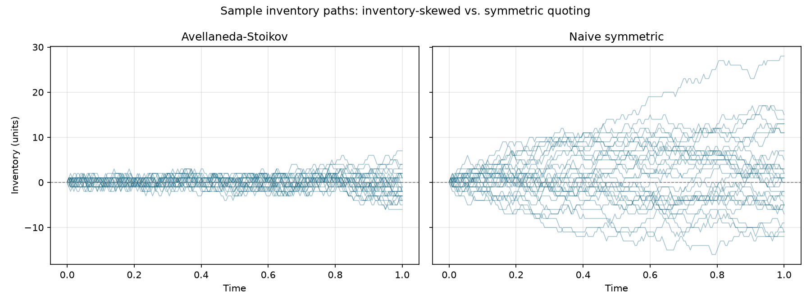
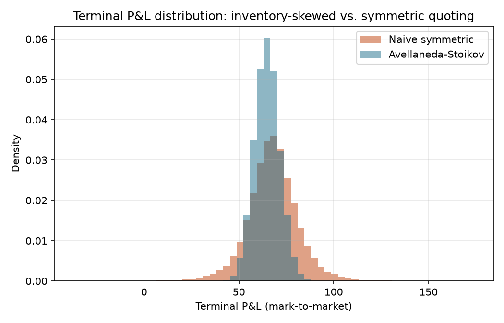
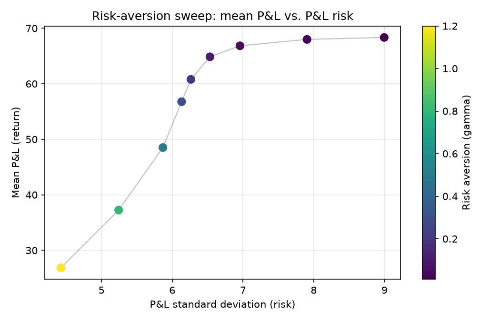
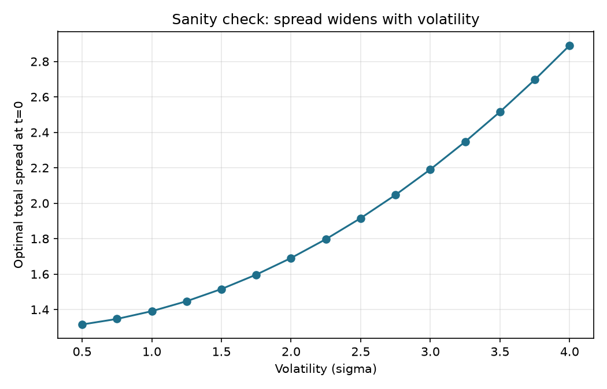

# Market Making Simulator (Avellaneda-Stoikov)

[](https://github.com/Seb-L-P/market-maker-quant/actions/workflows/ci.yml)

An implementation of Avellaneda & Stoikov's (2008) optimal market-making model — a risk-averse market maker continuously quoting bid/ask prices around a random-walk midprice, skewing quotes against current inventory to keep risk under control — benchmarked against a spread-matched naive baseline across tens of thousands of simulated trading days.

The question is not "does my simulation reproduce a known number" but "does a closed-form optimal policy actually outperform a naive one, and by how much" — a stochastic control result rather than a pricing formula, which means the answer has to be measured rather than derived.

## Results

Parameters throughout are Avellaneda & Stoikov's own 2008 numerical example: S0=100, σ=2, T=1 (200 steps of dt=0.005), γ=0.1, k=1.5, A=140. Reproduce with `python scripts/run_experiment.py`.

### Avellaneda-Stoikov vs. a spread-matched naive baseline

| | Avellaneda-Stoikov | Naive symmetric |
|---|---:|---:|
| Mean P&L | 64.86 | 67.92 |
| P&L std dev | 6.53 | 13.40 |
| Sharpe-like (mean/std) | 9.93 | 5.07 |
| Terminal inventory std dev | 2.92 | 8.42 |
| Mean \|inventory\| over the day | 0.98 | 4.37 |

The naive baseline isn't a strawman — it uses the *exact same* optimal-spread-width formula, just centered on the raw midprice instead of the inventory-adjusted reservation price. So this table isolates one thing precisely: **what does skewing your quotes against inventory buy you**, holding spread width and order flow fixed. Answer: essentially the same average revenue, for roughly half the P&L volatility.



This is the clearest single result. Left panel: AS inventory oscillates in a tight band around zero all day, visibly pulled back whenever it drifts. Right panel: naive inventory does an unconstrained random walk and several paths wander to ±20-28 units by end of day — real, uncompensated directional exposure that has nothing to do with market making and everything to do with the midprice happening to drift.



### Risk-aversion sweep — and a non-obvious finding

| γ | Mean P&L | P&L std | Sharpe-like | Mean \|inventory\| |
|---:|---:|---:|---:|---:|
| 0.01 | 68.35 | 9.00 | 7.60 | 2.58 |
| 0.02 | 67.99 | 7.91 | 8.60 | 1.98 |
| 0.05 | 66.84 | 6.96 | 9.61 | 1.35 |
| **0.10** | **64.86** | **6.53** | **9.93** | **0.98** |
| 0.20 | 60.80 | 6.26 | 9.71 | 0.69 |
| 0.30 | 56.77 | 6.13 | 9.26 | 0.55 |
| 0.50 | 48.51 | 5.87 | 8.27 | 0.38 |
| 0.80 | 37.25 | 5.24 | 7.11 | 0.26 |
| 1.20 | 26.86 | 4.43 | 6.07 | 0.18 |



Mean P&L and inventory both decrease monotonically as γ increases — no surprise, more risk aversion means quoting wider and holding less inventory, at the cost of less spread captured. What *isn't* obvious ahead of time: the **Sharpe-like ratio peaks around γ≈0.1 and declines on both sides of it.** Too little risk aversion leaves real, uncompensated inventory risk on the table; too much sacrifices so much mean P&L chasing ever-smaller inventory that risk-adjusted performance gets worse too, not better. There's an interior optimum, not a monotonic "more caution is always better" relationship — genuinely the same shape as an efficient frontier in portfolio theory, which makes sense: this *is* a risk-aversion-parameterized allocation problem, just for inventory instead of asset weights.



Pure formula sanity check, no simulation involved: quoted spread should widen as volatility rises (more inventory risk per unit time → charge more to bear it), and it does, roughly quadratically — consistent with the `γσ²(T−t)` term in the optimal-spread formula.

### Adverse selection: informed flow flips the ranking

The baseline model's order flow is pure noise — a fill is a random gift. Real flow isn't: the fact that someone traded into a resting quote is itself (partial) evidence the price is about to move through it. The simulator models this with a permanent-impact parameter ξ: every bid fill pushes the midprice down by ξ, every ask fill pushes it up — the standard stylized model of informed flow (`adverse_selection` in `simulator.py`, still bit-for-bit identical to the baseline at ξ=0, verified by test).

| ξ (impact/fill) | AS mean P&L | AS Sharpe-like | Naive mean P&L | Naive Sharpe-like |
|---:|---:|---:|---:|---:|
| 0.00 | 64.86 | 9.93 | **67.92** | 5.07 |
| 0.05 | 62.75 | 9.76 | 64.38 | 4.75 |
| 0.10 | 60.65 | 9.55 | 60.84 | 4.30 |
| 0.20 | **56.43** | 9.04 | 53.77 | 3.26 |

The finding worth stating carefully: **with pure noise flow, the naive symmetric quoter actually earns *more* mean P&L** (67.9 vs. 64.9 — the AS policy sacrifices some spread capture whenever its skewed quotes sit further from the mid on one side) — it just does so at double the P&L volatility. **As flow gets more informed, the ranking flips even on raw mean P&L** (crossover near ξ≈0.1; by ξ=0.2 AS earns more in absolute terms, 56.4 vs. 53.8), and the Sharpe-like gap widens from 2x to 2.8x. The mechanism: adverse selection is a tax per unit of inventory held against an informed move, and the AS policy's inventory-skew recycles positions faster, so it simply has less inventory sitting in the way when the price moves through it. Inventory control turns out to be a partial hedge against toxicity, not just against random inventory risk — which is precisely why real market makers treat inventory skew as non-negotiable even when it costs spread capture in calm conditions. Full sweep in `results/adverse_selection_sweep.csv`.

The simulator also supports a hard position cap (`max_inventory`) — the standard risk-limit implementation: the side whose fill would breach the cap is simply not quoted, rather than "quoted wide and hoped about." Both knobs preserve the common-random-numbers discipline (RNG draws are made unconditionally in a fixed order), so any run with either enabled remains directly comparable against the baseline on the same seed.

## Methodology

**Midprice (`market.py`).** Arithmetic Brownian motion, `dS_t = σ dW_t`, no drift — the model in the AS paper, not a simplification of it. The reservation-price and optimal-spread formulas below are derived (via HJB) specifically for *additive*, not multiplicative, volatility; swapping in GBM would mean re-deriving the closed form, not just changing the simulator. Fully vectorized: one `cumsum` of increments produces all simulated trading days' midprice paths at once, no time loop at all (the same pattern used for GBM path simulation in the options-pricing project's LSM module).

**The policy (`avellaneda_stoikov.py`).** Two pieces of closed form from the paper:
- **Reservation price** `r = s − qγσ²(T−t)`: the price at which the market maker is indifferent to holding one more unit of inventory. Not the midprice — shifted against current inventory `q`. Long inventory pulls it down; short inventory pushes it up.
- **Optimal spread** `δ_a+δ_b = γσ²(T−t) + (2/γ)ln(1+γ/k)`, split symmetrically around the reservation price. The first term is inventory-risk compensation that shrinks to zero as the trading horizon closes (less time left to carry risk); the second is a pure order-flow/risk-aversion term with no time dependence.

Quoting the reservation price instead of the midprice, symmetrically, is what makes the *ask* more attractive to sell into and the *bid* less attractive to buy more into whenever inventory is long — the mechanism that keeps inventory near zero without ever coding an explicit "if long, sell more" rule. It falls out of the price alone.

**Order arrivals and the simulation loop (`simulator.py`).** A resting quote a distance δ below/above the midprice gets hit with probability ≈`λ(δ)·dt` per step, where `λ(δ)=A·e^{−kδ}` — the standard first-order discretization of two independent Poisson processes (bid-side and ask-side arrivals), each drawn as an *independent* Bernoulli trial per step (not mutually exclusive — both a buy and a sell can arrive in the same step, which is realistic and just nets to a wash on inventory while still banking the spread). Same "loop over time, vectorize across simulations" pattern used for the binomial tree and LSM regression in the options project and the block-bootstrap in the blackjack project: the only Python-level loop is over the 200 time steps, and every step updates all 50,000 simulated trading days simultaneously via NumPy.

**Common random numbers, twice over.** `simulate()` reseeds its own RNG from a fixed `seed`, so running it once with the inventory skew on and once off reuses *identical* midprice paths and order-arrival draws in both runs — any resulting difference in P&L/inventory is attributable to the quoting policy, not to one run getting luckier order flow. The same trick isolates the risk-aversion sweep: every γ in the sweep sees the same midprice paths and arrival draws, so the sweep traces out the effect of γ alone.

## Validating against the paper

Rather than trust the implementation on formula inspection alone, the numbers were checked against the *qualitative* result the original paper reports for this exact parameter set: comparable mean P&L between the AS and symmetric strategies, meaningfully lower P&L and inventory variance for AS, and inventory that visibly mean-reverts rather than drifts. All of that reproduced directly (see the results above) — a stronger check than matching one absolute number, for the same reason cross-checking three independent rule-variant effects was stronger evidence than one house-edge number in the blackjack project.

The probability-clipping fallback (`p_bid`/`p_ask` clipped to `[0,1]`, needed because `λ·dt` can technically exceed 1 for extreme inventory/parameter combinations) binds on **0.008% of bid/ask opportunities** — confirmation that the chosen `dt=0.005` is fine-grained enough for the Poisson approximation to hold almost everywhere, not a crutch papering over an unstable parameter regime.

## Assumptions & limitations

- **Reduced-form order arrivals, not a reconstructed limit order book.** This is deliberate, not a shortcut — it's the model in the original paper. A full LOB simulator (resting orders from other participants, price-time priority, realistic order-flow dynamics) would be a substantially larger, different project; see Extensions.
- **Symmetric spread split** (`δ_a = δ_b`) around the reservation price, as in the paper's own presentation, rather than the fully general asymmetric solution.
- **Fixed γ, k, A, σ for the whole trading day** — no regime changes, no intraday seasonality in order flow (real markets are busier at the open/close), no adverse-selection-driven widening around news events.
- **Inventory is unbounded by default** — the AS policy discourages large inventory but doesn't forbid it. A hard cap is available (`max_inventory`) and tested, but the headline comparison runs uncapped to match the paper; no capital/margin constraint is modeled either way.
- **Adverse selection is stylized** — a constant permanent impact per fill, not a model of *which* fills are informed (no order-size information, no clustering of toxicity, no spread-widening response by the quoting policy). Enough to show the qualitative effect honestly; a toxicity-aware policy is an extension, not a given.
- **Mark-to-market P&L** values terminal inventory at the final simulated midprice; it doesn't model the cost of actually unwinding a residual position (crossing the spread to flatten at day's end).

## Project structure

```
src/mm/
  market.py               vectorized midprice random walk (arithmetic BM)
  avellaneda_stoikov.py   reservation price + optimal spread closed form
  naive.py                 spread-matched symmetric baseline
  simulator.py             vectorized order-arrival simulation, inventory/cash/P&L
  metrics.py               summary stats: P&L, inventory risk, Sharpe-like ratio
  plotting.py               report plots
scripts/
  run_experiment.py        AS vs. naive, risk-aversion sweep, volatility sanity check
tests/                      martingale/variance checks, AS formula monotonicity,
                            P&L accounting consistency, AS-vs-naive risk reduction
results/                    generated plots, CSVs, and summary.json from the run above
```

## Running it

```bash
python3 -m venv .venv && source .venv/bin/activate
pip install -r requirements.txt

pytest tests/ -v
python scripts/run_experiment.py
```

## Possible extensions

- A real limit order book with resting orders from other simulated participants, rather than the reduced-form Poisson arrival model
- Position limits / hard inventory caps, and the resulting quote behavior at the boundary
- Regime-switching or time-of-day-varying order flow (A, k) instead of constants
- The fully general asymmetric bid/ask solution instead of the symmetric-split approximation
- Adverse selection: let the midprice's next move be predictable from recent order flow, and see how much the naive strategy's performance degrades relative to AS when being picked off is a real risk
